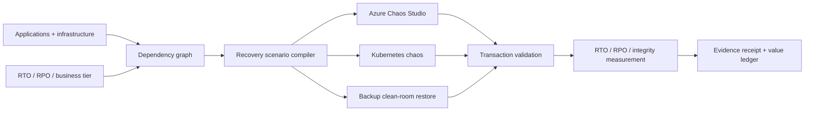

# Cloud Disaster Recovery and Business Continuity Validation Platform

## Microsoft Azure, AWS, Google Cloud, Kubernetes, DevOps, High Availability, SRE, Chaos Engineering, RTO and RPO

**ContinuityTwin** is an open-source recovery evidence compiler for multi-cloud and hybrid applications. It converts service dependencies, recovery timings, data-loss measurements, transaction checks and rollback evidence into an explainable disaster-recovery scorecard and deterministic receipt.

> **Claim boundary:** the included Azure revenue platform and all failures, timings, transactions and economics are synthetic. No cloud, Kubernetes, database or production system failure was injected. A modeled pass is not proof of a live recovery drill.

## Business problem

Backups, replicas and runbooks do not prove recovery. A system is recovered only when its dependencies are available, data is consistent and critical business transactions complete inside RTO and RPO commitments.

## Architecture



## Reproduce the recovery game day

```bash
pip install -e '.[test]'
pytest -q
continuitytwin examples/revenue-platform/game-day.json --output generated/revenue-platform
```

The scenario evaluates:

- PostgreSQL availability-zone failover with zero modeled RPO;
- complete primary Azure region loss;
- point-in-time recovery after destructive data change;
- dependency-aware recovery ordering;
- PaymentShield and order-to-cash transaction validation;
- duplicate, missing and checksum evidence;
- rollback verification;
- probability-weighted outage economics.

The destructive-data experiment intentionally fails because measured RPO exceeds the target. The engine does not tune inputs to manufacture a green scorecard.

## RTO and RPO

```text
RTO = detection + dependency recovery + transaction validation + backlog recovery
RPO = newest committed transaction before failure − newest valid recovered transaction
```

Detection, infrastructure recovery, business validation and backlog recovery remain visible rather than being compressed into one optimistic number.

## Ransomware recovery

The production path uses immutable, isolated backups, clean-room restore, credential rotation, artifact scanning, source verification, transaction checks and accountable approval. Backup success alone is not accepted as evidence of recoverability.

## Azure and multi-cloud path

The target architecture uses Azure Chaos Studio, Site Recovery, Azure Backup, immutable Blob Storage, AKS, Kubernetes Fleet Manager, Front Door, Traffic Manager, PostgreSQL, Cosmos DB, Service Bus, Event Hubs, Azure Monitor, Service Health, Sentinel, Entra ID, Key Vault, OpenTelemetry, Terraform/OpenTofu and Argo CD. AWS, GCP and on-premises providers enter through the same scenario and receipt contract.

The included Bicep creates a cost-bounded evidence plane. It does not deploy multi-region AKS, execute chaos or claim a ransomware restore.

## Agentic AI boundary

Agents may generate scenario candidates, correlate telemetry, explain failed gates and draft runbook improvements. They cannot trigger unrestricted production chaos, delete backups, promote recovery, accept data loss or change RTO/RPO commitments.

## Unit-economics integrity

The engine separates maximum contribution interruption, event probability, risk-adjusted outage value, recovered engineering capacity, avoided manual testing and annual platform cost. Catastrophe exposure is explicitly not represented as guaranteed annual savings.

## Search and international-role positioning

Broad terms: Cloud Computing, Microsoft Azure, AWS, Google Cloud, Kubernetes, DevOps, Cybersecurity, Artificial Intelligence, Cloud Architecture, Infrastructure as Code, Business Continuity, Disaster Recovery, High Availability and Site Reliability Engineering.

Specialist terms: Azure Disaster Recovery, Azure Site Recovery, Azure Backup, Ransomware Recovery, Multi-Region Architecture, AKS Disaster Recovery, Chaos Engineering, Azure Chaos Studio, RTO, RPO, Backup and Restore, Kubernetes Resilience, Database Failover, Operational Resilience, Incident Response, OpenTelemetry and Terraform.

Exact search-volume numbers require Google Keyword Planner, Semrush or Ahrefs and are not fabricated. See [search evidence](docs/search-positioning.md).

## Production acceptance

Real deployment requires authorized cloud connectors, signed timestamps, workload-specific transactions, isolated recovery environments, least-privilege experiment identities, abort automation, clean-room verification and actual failover/restore receipts. See [production readiness](docs/production-readiness.md).

## Work with A2Z SOC

Need evidence that critical systems can actually recover? **[Request a Cloud Resilience and Disaster Recovery Game Day](https://a2zsoc.com)** covering Azure, Kubernetes, databases, ransomware recovery, transaction validation and business economics.
